# HSI Model - Complete Flow with Anomaly Classification

## Complete Architecture: Autoencoder + Transformer + Classification Pipeline

```mermaid
graph TD

    subgraph "🔷 1. Input"
        P1[Patch Input<br/><i>Shape: batch × 4096</i>]
        GT[Ground Truth Labels<br/><i>Class labels for patches</i>]
    end

    subgraph "🔵 2. Autoencoder Path"
        direction TB
        E["Encoder<br/><i>Linear(4096→512) → ReLU → Linear(512→32)</i>"]
        Z[⚡ Latent Z<br/><i>Shape: batch × 32</i>]
        D["Decoder<br/><i>Linear(32→512) → ReLU → Linear(512→4096)</i>"]
        R[✨ Reconstructed Patch<br/><i>Shape: batch × 4096</i>]
    end
    
    subgraph "🟠 3. Transformer Path"
        direction TB
        T["Transformer Scorer<br/><i>Multi-Head Attention → Linear(32→64) → Linear(64→1)</i>"]
        S[🎯 Anomaly Score<br/><i>Shape: batch × 1</i>]
    end

    subgraph "🟢 4. Classification Path"
        direction TB
        PCA_SVM["PCA Reduction (Optional)<br/><i>Reduce latent to 20 dims<br/>if latent_dim > 20</i>"]
        SVM["SVM Classifier<br/><i>Kernel: RBF<br/>C: 5 or 10<br/>Class Weights: Balanced</i>"]
        PRED[📋 Class Predictions<br/><i>Predicted class labels</i>]
        PROB[📊 Class Probabilities<br/><i>Probability per class</i>]
    end

    subgraph "📊 5. Anomaly Analysis & Output"
        direction TB
        L["Compute Reconstruction Error<br/><i>MSE(Original, Reconstructed)</i>"]
        THRESH["Calculate Threshold<br/><i>95th percentile<br/>of reconstruction errors</i>"]
        ANOM_DET["Anomaly Detection<br/><i>Error > Threshold → Anomaly</i>"]
        N["Normalize Anomaly Score<br/><i>Min-Max Scale to [0, 1]</i>"]
        M[🗺️ Generate Anomaly Map<br/><i>Combine Error & Score<br/>Shape: H × W</i>]
    end

    subgraph "📈 6. Classification Metrics & Evaluation"
        direction TB
        METRICS["Classification Metrics<br/><i>Accuracy, Precision<br/>Recall, F1-Score</i>"]
        CM[📊 Confusion Matrix<br/><i>True vs Predicted Labels</i>]
        REPORT[📄 Classification Report<br/><i>Per-class metrics<br/>CSV output</i>]
    end

    subgraph "🖼️ 7. Visualization Outputs"
        direction LR
        OVERLAY[🖼️ Anomaly Overlay<br/><i>RGB + Anomaly Heatmap</i>]
        TSNE[📊 t-SNE Visualization<br/><i>Latent Space 2D Projection</i>]
        CM_VIS[📊 Confusion Matrix Plot<br/><i>Heatmap visualization</i>]
    end

    %% --- Main Data Flow ---
    P1 --> E
    E --> Z
    Z --> D
    Z --> T
    Z --> PCA_SVM
    D --> R

    T --> S
    PCA_SVM --> SVM
    GT --> SVM
    SVM --> PRED
    SVM --> PROB

    %% --- Anomaly Detection Flow ---
    P1 -.->|Original| L
    R -->|Reconstructed| L
    L --> THRESH
    THRESH --> ANOM_DET
    S --> N

    ANOM_DET -->|Recon. Error| M
    N -->|Normalized Score| M
    M --> OVERLAY

    %% --- Classification Evaluation Flow ---
    GT -.->|True Labels| METRICS
    PRED -->|Predictions| METRICS
    PRED -->|Predictions| CM
    GT -.->|True Labels| CM
    METRICS --> REPORT
    CM --> CM_VIS

    %% --- Visualization Flow ---
    Z --> TSNE
    GT -.->|For coloring| TSNE

    %% --- Styling ---
    style P1 fill:#e1f5ff,stroke:#01579b,stroke-width:2px,color:#000
    style GT fill:#e1f5ff,stroke:#01579b,stroke-width:2px,color:#000
    style E fill:#e3f2fd,stroke:#1976d2,stroke-width:2px,color:#000
    style D fill:#f3e5f5,stroke:#7b1fa2,stroke-width:2px,color:#000
    style T fill:#fff3e0,stroke:#f57c00,stroke-width:2px,color:#000
    style R fill:#f3e5f5,stroke:#7b1fa2,stroke-width:2px,color:#000
    style PCA_SVM fill:#e8f5e9,stroke:#388e3c,stroke-width:2px,color:#000
    style SVM fill:#e8f5e9,stroke:#388e3c,stroke-width:3px,color:#000
    style L,N,THRESH,ANOM_DET fill:#e8f5e9,stroke:#388e3c,stroke-width:2px,color:#000

    %% --- Key Nodes ---
    style Z fill:#ffeb3b,stroke:#f57f17,stroke-width:3px,color:#000
    style S fill:#4caf50,stroke:#2e7d32,stroke-width:3px,color:#000
    style PRED fill:#4caf50,stroke:#2e7d32,stroke-width:2px,color:#000
    style M fill:#f44336,stroke:#c62828,stroke-width:3px,color:#000
    style METRICS fill:#81c784,stroke:#388e3c,stroke-width:2px,color:#000
    style CM fill:#81c784,stroke:#388e3c,stroke-width:2px,color:#000
    style REPORT fill:#81c784,stroke:#388e3c,stroke-width:2px,color:#000
    style OVERLAY fill:#ffccbc,stroke:#e64a19,stroke-width:2px,color:#000
    style TSNE fill:#ffccbc,stroke:#e64a19,stroke-width:2px,color:#000
    style CM_VIS fill:#ffccbc,stroke:#e64a19,stroke-width:2px,color:#000
```



---

## Detailed Flow Explanation

### 1. **Input Stage**
- **Patch Input**: Flattened hyperspectral patches (batch × 4096 for 16×16×16)
- **Ground Truth**: Class labels for supervised learning

### 2. **Autoencoder Path**
- **Encoder**: Compresses patches to 32-dimensional latent space
- **Latent Z**: Compact feature representation (batch × 32)
- **Decoder**: Reconstructs patches from latent space
- **Purpose**: Learn spatial-spectral patterns, extract features

### 3. **Transformer Path**
- **Transformer Scorer**: Multi-head self-attention mechanism
- **Anomaly Score**: Single value per patch indicating anomaly likelihood
- **Purpose**: Context-aware anomaly detection in latent space

### 4. **Classification Path**
- **PCA Reduction**: Optional dimensionality reduction for SVM (max 20 dims)
- **SVM Classifier**: RBF kernel with balanced class weights
- **Predictions**: Class labels for each patch
- **Probabilities**: Probability distribution over all classes
- **Purpose**: Supervised classification using latent features

### 5. **Anomaly Analysis**
- **Reconstruction Error**: MSE between original and reconstructed patches
- **Threshold**: 95th percentile of reconstruction errors
- **Anomaly Detection**: Binary decision based on error threshold
- **Score Normalization**: Min-Max scaling of transformer scores
- **Anomaly Map**: Spatial distribution combining both methods

### 6. **Classification Evaluation**
- **Metrics**: Accuracy, Precision, Recall, F1-score
- **Confusion Matrix**: Detailed classification breakdown
- **Report**: Per-class performance metrics (CSV format)

### 7. **Visualization Outputs**
- **Anomaly Overlay**: RGB image with anomaly heatmap overlay
- **t-SNE Plot**: 2D visualization of latent space colored by class
- **Confusion Matrix Plot**: Visual heatmap of classification results

---

## Combined Anomaly Detection Logic

### Method 1: Reconstruction Error-Based
```
For each patch:
  1. Compute: Error = MSE(Original_Patch, Reconstructed_Patch)
  2. Calculate: threshold = percentile(errors, 95)
  3. Anomaly if: Error > threshold
```

### Method 2: Transformer Score-Based
```
For each patch:
  1. Extract latent features: Z = Encoder(Patch)
  2. Compute: Score = Transformer(Z)
  3. Normalize: Score_norm = (Score - min) / (max - min)
  4. Anomaly if: Score_norm > threshold_score
```

### Combined Approach
```
Anomaly Map combines:
  - Reconstruction Error (spatial distribution)
  - Transformer Scores (context-aware detection)
  - Classification Predictions (supervised labels)
  
Final Output: H × W spatial anomaly map
```

---

## Classification Pipeline Logic


---

## Key Design Decisions

### Why Two Anomaly Detection Methods?
1. **Reconstruction Error**: 
   - Simple, interpretable
   - Directly measures how well model learned patterns
   - Works well for obvious anomalies

2. **Transformer Score**:
   - Context-aware through attention mechanism
   - Can detect subtle anomalies
   - Leverages relationships in latent space

### Why SVM for Classification?
- Works well with small to medium datasets
- Handles high-dimensional features effectively
- RBF kernel captures non-linear relationships
- Balanced class weights handle imbalanced data

### Combined Output
- Anomaly Map shows spatial distribution
- Classification provides class labels
- Together: Comprehensive analysis of HSI data

---

## Output Files Generated

1. **Anomaly Detection**:
   - `{dataset}_anomaly_map.png` - Anomaly heatmap
   - `{dataset}_anomaly_map_overlay.png` - RGB overlay
   - `{dataset}_ae_loss_curve.png` - Training loss

2. **Classification**:
   - `confusion_matrix_{dataset}.png` - Confusion matrix plot
   - `classification_report_{dataset}.csv` - Metrics CSV
   - `anomaly_overlay_{dataset}.png` - Anomalies on RGB

3. **Visualization**:
   - `{dataset}_tsne_visualization.png` - Latent space t-SNE
   - `{dataset}_pca_rgb.png` - PCA RGB image

---

This complete flow diagram shows how the HSI model processes images through both anomaly detection and classification pipelines, providing comprehensive analysis of hyperspectral data.

