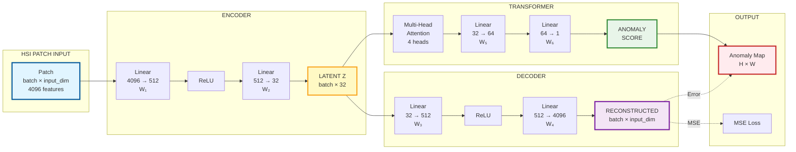
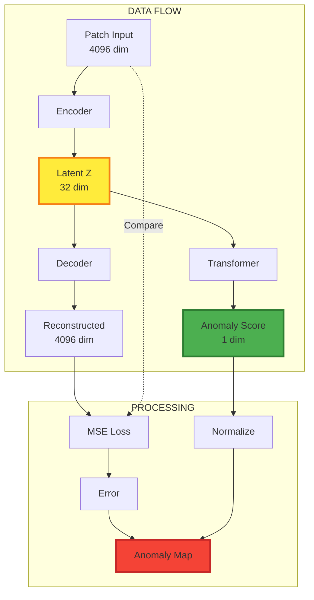

# HSI Model Architecture - Visual Diagram

## Complete Model Architecture Visualization

```mermaid
graph TB
    subgraph INPUT["🔷 INPUT LAYER"]
        direction LR
        PatchInput[HSI Patch Input<br/>━━━━━━━━━━━━━━━━━━<br/>Shape: batch × input_dim<br/>input_dim = patch_size² × PCA_dim<br/>Example: 512 × 4096<br/>for 16×16 patch, 16 PCA]
    end
    
    subgraph ENCODER["🔵 ENCODER NETWORK"]
        direction TB
        
        E1[┌─────────────────────────────────┐<br/>│ Linear Layer 1                    │<br/>│ ───────────────────────────────── │<br/>│ Input:  batch × input_dim          │<br/>│ Weights: W₁ [input_dim × 512]      │<br/>│ Bias:    b₁ [512]                   │<br/>│ Output:  batch × 512                │<br/>│ Params:  input_dim×512 + 512        │<br/>└─────────────────────────────────┘]
        
        E2[┌─────────────────────────────────┐<br/>│ ReLU Activation                   │<br/>│ ───────────────────────────────── │<br/>│ f(x) = max(0, x)                   │<br/>│ Element-wise operation             │<br/>│ Output:  batch × 512                │<br/>└─────────────────────────────────┘]
        
        E3[┌─────────────────────────────────┐<br/>│ Linear Layer 2                    │<br/>│ ───────────────────────────────── │<br/>│ Input:  batch × 512                │<br/>│ Weights: W₂ [512 × 32]              │<br/>│ Bias:    b₂ [32]                    │<br/>│ Output:  batch × 32                 │<br/>│ Params:  512×32 + 32 = 16,416       │<br/>└─────────────────────────────────┘]
        
        LatentZ[⚡ LATENT REPRESENTATION Z<br/>━━━━━━━━━━━━━━━━━━━━━━━━━━━<br/>Shape: batch × 32<br/>Compact Feature Vector<br/>Encodes spatial-spectral patterns<br/>━━━━━━━━━━━━━━━━━━━━━━━━━━━]
        
        PatchInput --> E1
        E1 --> E2
        E2 --> E3
        E3 --> LatentZ
    end
    
    subgraph DECODER["🟣 DECODER NETWORK"]
        direction TB
        
        D1[┌─────────────────────────────────┐<br/>│ Linear Layer 1                    │<br/>│ ───────────────────────────────── │<br/>│ Input:  batch × 32                  │<br/>│ Weights: W₃ [32 × 512]               │<br/>│ Bias:    b₃ [512]                    │<br/>│ Output:  batch × 512                 │<br/>│ Params:  32×512 + 512 = 16,896       │<br/>└─────────────────────────────────┘]
        
        D2[┌─────────────────────────────────┐<br/>│ ReLU Activation                   │<br/>│ ───────────────────────────────── │<br/>│ f(x) = max(0, x)                   │<br/>│ Element-wise operation             │<br/>│ Output:  batch × 512                │<br/>└─────────────────────────────────┘]
        
        D3[┌─────────────────────────────────┐<br/>│ Linear Layer 2                    │<br/>│ ───────────────────────────────── │<br/>│ Input:  batch × 512                 │<br/>│ Weights: W₄ [512 × input_dim]        │<br/>│ Bias:    b₄ [input_dim]              │<br/>│ Output:  batch × input_dim           │<br/>│ Params:  512×input_dim + input_dim    │<br/>└─────────────────────────────────┘]
        
        Recon[✨ RECONSTRUCTED PATCH X̂<br/>━━━━━━━━━━━━━━━━━━━━━━━━━━━<br/>Shape: batch × input_dim<br/>Reconstruction of Original Input<br/>Used for MSE Loss Calculation<br/>━━━━━━━━━━━━━━━━━━━━━━━━━━━]
        
        LatentZ --> D1
        D1 --> D2
        D2 --> D3
        D3 --> Recon
    end
    
    subgraph LOSS["📊 LOSS COMPUTATION"]
        direction LR
        MSE[┌─────────────────────────────────┐<br/>│ MSE Loss Function                 │<br/>│ ───────────────────────────────── │<br/>│ L = (1/N) Σᵢ ||xᵢ - x̂ᵢ||²        │<br/>│                                   │<br/>│ Measures reconstruction quality   │<br/>│ Higher error = Potential anomaly  │<br/>└─────────────────────────────────┘]
        
        PatchInput -.->|Original| MSE
        Recon -->|Reconstructed| MSE
    end
    
    subgraph TRANSFORMER["🟠 TRANSFORMER ANOMALY SCORER"]
        direction TB
        
        T1[┌─────────────────────────────────┐<br/>│ Unsqueeze Operation              │<br/>│ ───────────────────────────────── │<br/>│ Input:  batch × 32                 │<br/>│ Add sequence dimension             │<br/>│ Output: batch × 1 × 32             │<br/>└─────────────────────────────────┘]
        
        T2[┌─────────────────────────────────┐<br/>│ Generate Q, K, V                 │<br/>│ ───────────────────────────────── │<br/>│ Q = z' · W_q  [batch × 1 × 32]     │<br/>│ K = z' · W_k  [batch × 1 × 32]     │<br/>│ V = z' · W_v  [batch × 1 × 32]     │<br/>│ W_q, W_k, W_v ∈ R^32×32            │<br/>└─────────────────────────────────┘]
        
        T3[┌─────────────────────────────────┐<br/>│ Multi-Head Self-Attention         │<br/>│ ───────────────────────────────── │<br/>│ Heads: 4                           │<br/>│ Head Dim: 8 (32/4)                 │<br/>│ Attention = softmax(QKᵀ/√8) · V    │<br/>│ Output: batch × 1 × 32              │<br/>│ Params: 12,288                      │<br/>└─────────────────────────────────┘]
        
        T4[┌─────────────────────────────────┐<br/>│ Squeeze Operation                │<br/>│ ───────────────────────────────── │<br/>│ Remove sequence dimension          │<br/>│ Input:  batch × 1 × 32             │<br/>│ Output: batch × 32                  │<br/>└─────────────────────────────────┘]
        
        T5[┌─────────────────────────────────┐<br/>│ Linear Layer 1                    │<br/>│ ───────────────────────────────── │<br/>│ Input:  batch × 32                 │<br/>│ Weights: W₅ [32 × 64]               │<br/>│ Bias:    b₅ [64]                    │<br/>│ Output:  batch × 64                 │<br/>│ Params:  2,112                       │<br/>└─────────────────────────────────┘]
        
        T6[┌─────────────────────────────────┐<br/>│ ReLU Activation                   │<br/>│ ───────────────────────────────── │<br/>│ f(x) = max(0, x)                   │<br/>│ Output:  batch × 64                 │<br/>└─────────────────────────────────┘]
        
        T7[┌─────────────────────────────────┐<br/>│ Linear Layer 2                    │<br/>│ ───────────────────────────────── │<br/>│ Input:  batch × 64                  │<br/>│ Weights: W₆ [64 × 1]                │<br/>│ Bias:    b₆ [1]                     │<br/>│ Output:  batch × 1                  │<br/>│ Params:  65                          │<br/>└─────────────────────────────────┘]
        
        AnomScore[🎯 ANOMALY SCORE<br/>━━━━━━━━━━━━━━━━━━━━━━━━━━━<br/>Shape: batch × 1<br/>Higher score = Higher anomaly likelihood<br/>Used for anomaly detection<br/>━━━━━━━━━━━━━━━━━━━━━━━━━━━]
        
        LatentZ --> T1
        T1 --> T2
        T2 --> T3
        T3 --> T4
        T4 --> T5
        T5 --> T6
        T6 --> T7
        T7 --> AnomScore
    end
    
    subgraph ANOMALY["🔴 ANOMALY DETECTION"]
        direction TB
        
        Norm[┌─────────────────────────────────┐<br/>│ Normalize Scores                  │<br/>│ ───────────────────────────────── │<br/>│ score_norm = (score-min)/(max-min) │<br/>│ Range: [0, 1]                     │<br/>└─────────────────────────────────┘]
        
        Error[┌─────────────────────────────────┐<br/>│ Reconstruction Error             │<br/>│ ───────────────────────────────── │<br/>│ Error = ||X - X̂||²                │<br/>│ Per sample MSE                    │<br/>└─────────────────────────────────┘]
        
        Thresh[┌─────────────────────────────────┐<br/>│ Threshold Check                  │<br/>│ ───────────────────────────────── │<br/>│ threshold = 95th percentile       │<br/>│ anomaly = error > threshold       │<br/>└─────────────────────────────────┘]
        
        Map[🗺️ ANOMALY MAP<br/>━━━━━━━━━━━━━━━━━━━━━━━━━━━<br/>Spatial Distribution<br/>Shape: H × W<br/>Visual representation of anomalies<br/>━━━━━━━━━━━━━━━━━━━━━━━━━━━]
        
        AnomScore --> Norm
        Norm --> Map
        Recon --> Error
        Error --> Thresh
        Thresh --> Map
    end
    
    %% Styling
    classDef inputStyle fill:#e1f5ff,stroke:#01579b,stroke-width:4px,color:#000
    classDef encoderStyle fill:#e3f2fd,stroke:#1976d2,stroke-width:3px,color:#000
    classDef decoderStyle fill:#f3e5f5,stroke:#7b1fa2,stroke-width:3px,color:#000
    classDef transformerStyle fill:#fff3e0,stroke:#f57c00,stroke-width:3px,color:#000
    classDef outputStyle fill:#e8f5e9,stroke:#388e3c,stroke-width:3px,color:#000
    classDef latentStyle fill:#fff9c4,stroke:#f9a825,stroke-width:4px,color:#000
    
    class PatchInput inputStyle
    class E1,E2,E3 encoderStyle
    class LatentZ latentStyle
    class D1,D2,D3 decoderStyle
    class Recon,MSE lossStyle
    class T1,T2,T3,T4,T5,T6,T7 transformerStyle
    class AnomScore,Norm,Error,Thresh,Map outputStyle
```

---

## Simplified Architecture Diagram



---

## ASCII Art Visual Diagram

```
╔═══════════════════════════════════════════════════════════════════════════════════════════════════════════╗
║                                    HSI MODEL ARCHITECTURE                                                  ║
╚═══════════════════════════════════════════════════════════════════════════════════════════════════════════╝

┌─────────────────────────────────────────────────────────────────────────────────────────────────────────────┐
│                                        INPUT LAYER                                                          │
│  ┌─────────────────────────────────────────────────────────────────────────────────────┐                   │
│  │  HSI Patch Input: batch × input_dim                                                  │                   │
│  │  Example: 512 × 4096 (for 16×16 patch, 16 PCA components)                          │                   │
│  └─────────────────────────────────────────────────────────────────────────────────────┘                   │
└─────────────────────────────────────────────────────────────────────────────────────────────────────────────┘
                                           │
                                           ▼
┌─────────────────────────────────────────────────────────────────────────────────────────────────────────────┐
│                                      ENCODER NETWORK                                                        │
│  ┌──────────────────────┐     ┌──────────────────────┐     ┌──────────────────────┐                       │
│  │  Linear Layer 1      │────▶│   ReLU Activation    │────▶│  Linear Layer 2       │                       │
│  │  input_dim → 512     │     │   f(x) = max(0,x)    │     │  512 → 32 (latent)   │                       │
│  │  W₁: [input_dim×512]  │     │                      │     │  W₂: [512×32]        │                       │
│  │  b₁: [512]            │     │                      │     │  b₂: [32]            │                       │
│  └──────────────────────┘     └──────────────────────┘     └──────────────────────┘                       │
│                                           │                                                               │
│                                           ▼                                                               │
│                              ┌─────────────────────────────┐                                              │
│                              │  ⚡ LATENT REPRESENTATION Z  │                                              │
│                              │  Shape: batch × 32           │                                              │
│                              │  Compact Feature Vector       │                                              │
│                              └─────────────────────────────┘                                              │
└─────────────────────────────────────────────────────────────────────────────────────────────────────────────┘
                                           │
                    ┌──────────────────────┴──────────────────────┐
                    │                                             │
                    ▼                                             ▼
┌──────────────────────────────────────────┐    ┌──────────────────────────────────────────────────────────┐
│      DECODER NETWORK                      │    │           TRANSFORMER ANOMALY SCORER                     │
│  ┌──────────────────────┐                │    │  ┌─────────────┐  ┌─────────────┐  ┌─────────────┐       │
│  │  Linear Layer 1      │                │    │  │ Unsqueeze   │─▶│ Multi-Head  │─▶│  Squeeze    │       │
│  │  32 → 512            │                │    │  │ batch×32 →  │  │ Attention   │  │ batch×1×32 │       │
│  │  W₃: [32×512]        │                │    │  │ batch×1×32   │  │ (4 heads)   │  │ → batch×32  │       │
│  └──────────────────────┘                │    │  └─────────────┘  └─────────────┘  └─────────────┘       │
│           │                                │    │                           │                              │
│           ▼                                │    │                           ▼                              │
│  ┌──────────────────────┐                │    │                  ┌─────────────────────┐                │
│  │   ReLU Activation    │                │    │                  │  Linear Layer 1     │                │
│  │   f(x) = max(0,x)    │                │    │                  │  32 → 64            │                │
│  └──────────────────────┘                │    │                  │  W₅: [32×64]        │                │
│           │                                │    │                  └─────────────────────┘                │
│           ▼                                │    │                           │                              │
│  ┌──────────────────────┐                │    │                           ▼                              │
│  │  Linear Layer 2      │                │    │                  ┌─────────────────────┐                │
│  │  512 → input_dim     │                │    │                  │  ReLU Activation     │                │
│  │  W₄: [512×input_dim] │                │    │                  └─────────────────────┘                │
│  └──────────────────────┘                │    │                           │                              │
│           │                                │    │                           ▼                              │
│           ▼                                │    │                  ┌─────────────────────┐                │
│  ┌──────────────────────┐                │    │                  │  Linear Layer 2     │                │
│  │ ✨ RECONSTRUCTED X̂    │                │    │                  │  64 → 1             │                │
│  │  Shape: batch×input_dim│                │    │                  │  W₆: [64×1]         │                │
│  └──────────────────────┘                │    │                  └─────────────────────┘                │
└──────────────────────────────────────────┘    │                           │                              │
                    │                             │                           ▼                              │
                    │                             │                  ┌─────────────────────┐                │
                    │                             │                  │ 🎯 ANOMALY SCORE   │                │
                    │                             │                  │  Shape: batch × 1   │                │
                    │                             │                  └─────────────────────┘                │
                    │                             └──────────────────────────────────────────────────────────┘
                    │
                    │
                    ▼
        ┌─────────────────────────────┐
        │    MSE LOSS FUNCTION         │
        │  L = (1/N) Σ ||X - X̂||²     │
        │  Measures reconstruction    │
        │  error for anomaly detection │
        └─────────────────────────────┘
                    │
                    │
                    ▼
        ┌───────────────────────────────────────────────────┐
        │           ANOMALY DETECTION                       │
        │  ┌────────────────────────────────────────────┐   │
        │  │  Reconstruction Error: ||X - X̂||²         │   │
        │  │  Threshold: 95th percentile                │   │
        │  │  Anomaly = Error > Threshold                │   │
        │  └────────────────────────────────────────────┘   │
        │  ┌────────────────────────────────────────────┐   │
        │  │  Transformer Score Normalization            │   │
        │  │  Anomaly Map: H × W spatial distribution    │   │
        │  └────────────────────────────────────────────┘   │
        └───────────────────────────────────────────────────┘

╔═══════════════════════════════════════════════════════════════════════════════════════════════════════════╗
║  PARAMETER SUMMARY:                                                                                         ║
║  • Encoder:     ~2.1M parameters (input_dim × 512 + 512 × 32)                                             ║
║  • Decoder:     ~2.1M parameters (32 × 512 + 512 × input_dim)                                             ║
║  • Transformer: ~14K parameters (12,288 + 2,112 + 65)                                                     ║
║  • Total:       ~4.2M parameters                                                                            ║
╚═══════════════════════════════════════════════════════════════════════════════════════════════════════════╝
```

---

## Component Interaction Diagram



---

## Model Dimensions Flow

```
INPUT STAGE:
┌─────────────┐
│   Patch     │  batch × 4,096 (16×16×16)
└─────────────┘
      │
      ▼
ENCODER:
┌─────────────┐    ┌─────────────┐    ┌─────────────┐
│  Linear 1   │───▶│    ReLU     │───▶│  Linear 2   │
│ 4,096 → 512 │    │    512      │    │  512 → 32   │
└─────────────┘    └─────────────┘    └─────────────┘
      │                                     │
      │                                     ▼
      │                            ┌─────────────┐
      │                            │ Latent Z    │  batch × 32
      │                            └─────────────┘
      │                                     │
      │                  ┌──────────────────┴──────────────────┐
      │                  │                                     │
      ▼                  ▼                                     ▼
DECODER:         TRANSFORMER:                          CLASSIFICATION:
┌─────────────┐ ┌─────────────┐                     ┌─────────────┐
│  Linear 1   │ │ Attention   │                     │   SVM       │
│  32 → 512   │ │  4 heads    │                     │  Classifier │
└─────────────┘ └─────────────┘                     └─────────────┘
      │                  │                                   │
      ▼                  ▼                                   ▼
┌─────────────┐ ┌─────────────┐                     ┌─────────────┐
│    ReLU     │ │ Linear 1    │                     │ Predictions │
│    512      │ │  32 → 64     │                     │  Classes    │
└─────────────┘ └─────────────┘                     └─────────────┘
      │                  │
      ▼                  ▼
┌─────────────┐ ┌─────────────┐
│  Linear 2   │ │ Linear 2    │
│ 512 → 4096  │ │  64 → 1     │
└─────────────┘ └─────────────┘
      │                  │
      ▼                  ▼
┌─────────────┐ ┌─────────────┐
│Reconstructed│ │Anomaly Score│
│  4,096 dim  │ │    1 dim    │
└─────────────┘ └─────────────┘
      │                  │
      └──────────┬───────┘
                 ▼
          ┌─────────────┐
          │ Anomaly Map │
          │    H × W    │
          └─────────────┘
```

---

## Quick Reference Architecture

```
HSI Patch
  │
  ├─▶ ENCODER (Compression)
  │    4096 → 512 → 32 (latent)
  │
  ├─▶ LATENT Z (32-dim features)
  │    │
  │    ├─▶ DECODER (Reconstruction)
  │    │    32 → 512 → 4096
  │    │    │
  │    │    └─▶ MSE Loss → Reconstruction Error
  │    │
  │    └─▶ TRANSFORMER (Anomaly Scoring)
  │          32 → [Attention] → 64 → 1
  │          │
  │          └─▶ Anomaly Score
  │
  └─▶ ANOMALY DETECTION
        Combine: Error + Score → Anomaly Map
```

---

This document provides multiple visual representations of the model architecture, from detailed Mermaid diagrams to ASCII art, suitable for documentation and presentations.

